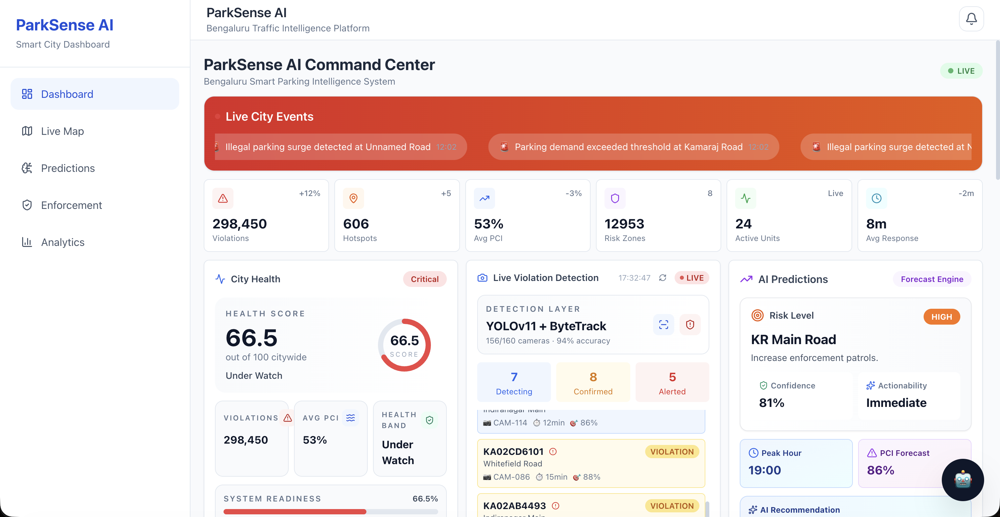
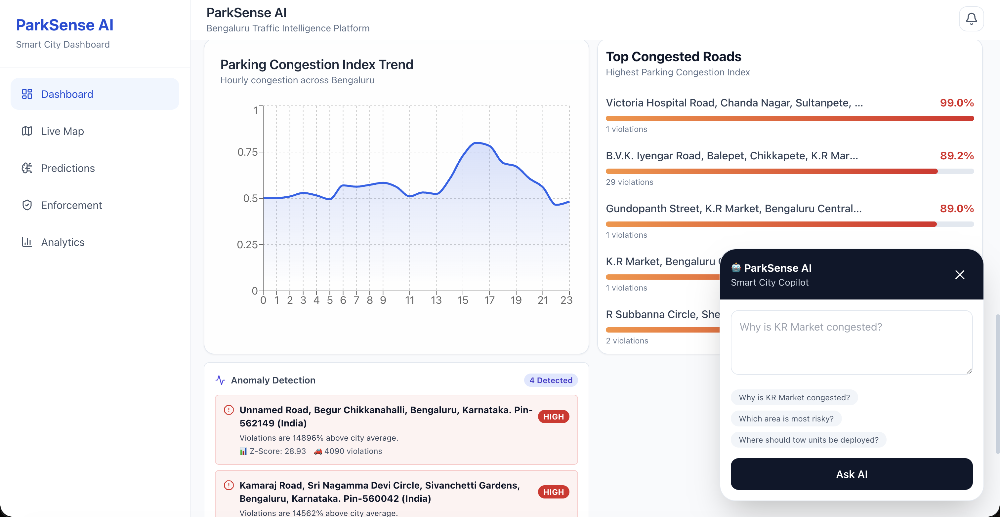
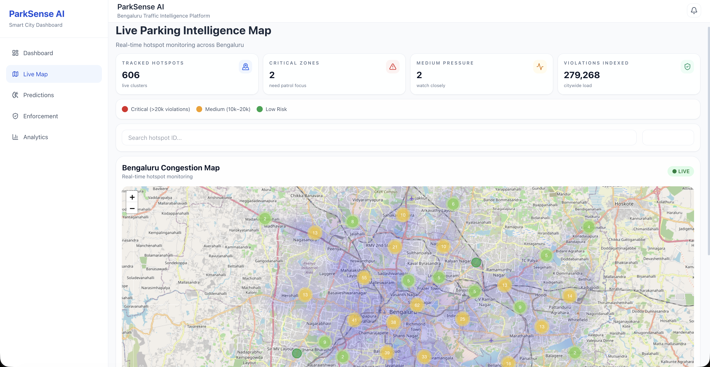
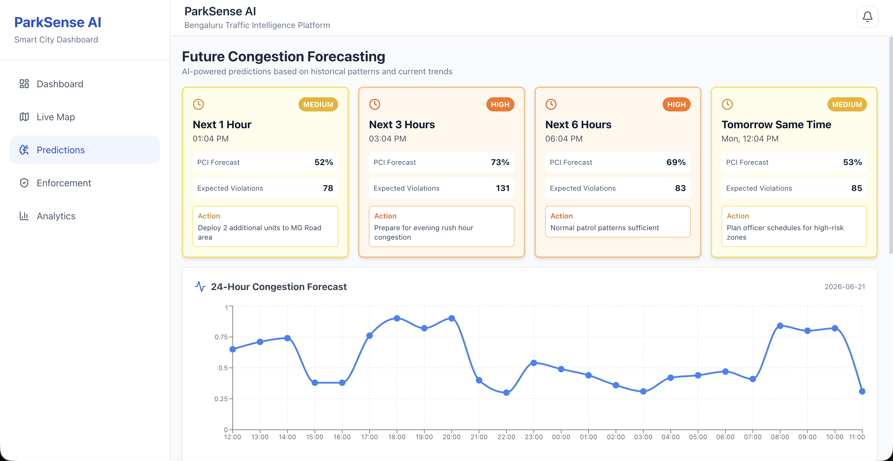
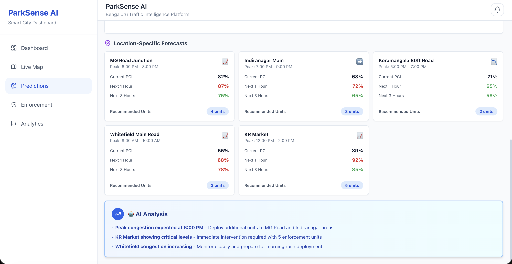
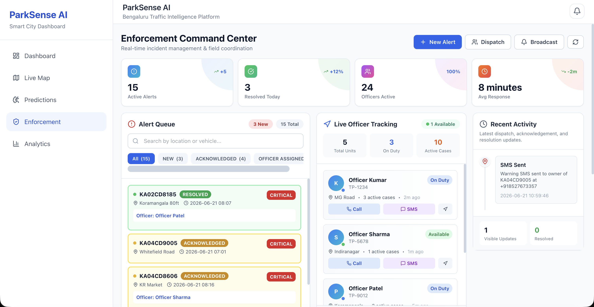
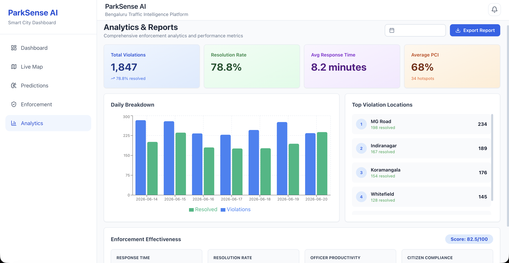

# 🚦 ParkSense AI

<p align="center">
  <h3 align="center">Predictive Parking Enforcement & Congestion Intelligence Platform</h3>
  <p align="center">
    AI-Powered Smart City Operations for Proactive Congestion Management
  </p>
</p>

<p align="center">
  
  
  
  
  
</p>

---

## 🌐 Live Resources

### 🚀 Live Platform

https://park-sense-ai-beta.vercel.app

### 🎥 Video Demonstration

https://youtu.be/rmu534u17yM

### 📑 Presentation Deck

https://canva.link/elpekys10md5d9y

---

# 📌 Overview

ParkSense AI is a smart-city congestion intelligence platform that transforms parking violation data into actionable operational intelligence.

Traditional parking enforcement systems are reactive. Violations are addressed only after congestion has already formed, resulting in inefficient resource allocation and delayed intervention.

ParkSense introduces a Parking Congestion Index (PCI), a unified congestion metric that quantifies the impact of illegal parking on traffic flow and urban mobility. The platform combines machine learning, geospatial analytics, forecasting, anomaly detection, enforcement orchestration, and conversational AI into a single operational command center.

---

# 🎯 Problem Statement

Urban congestion is frequently amplified by illegal and unmanaged parking behavior.

Current enforcement systems face several limitations:

* Reactive response after congestion occurs
* Limited visibility into future congestion risks
* Inefficient deployment of enforcement resources
* Lack of geospatial congestion intelligence
* Fragmented operational workflows
* Absence of predictive decision support

City authorities require a platform capable of predicting congestion patterns before they escalate and providing actionable enforcement recommendations.

---

# 💡 Solution

ParkSense AI enables proactive congestion management through a unified intelligence layer.

The platform:

* Detects parking congestion hotspots
* Forecasts future congestion conditions
* Identifies anomalous traffic patterns
* Prioritizes incidents using PCI scores
* Supports officer dispatch decisions
* Sends SMS and voice notifications
* Provides AI-powered operational insights

---

# 🏗️ System Architecture

```text
Parking Violation Data
            │
            ▼
  Parking Congestion Index
            │
            ▼
 ┌─────────────────────────────┐
 │      Intelligence Layer     │
 └─────────────────────────────┘
            │
 ┌──────────┼──────────┬──────────┐
 ▼          ▼          ▼          ▼

Forecast   Hotspots  Anomaly   Analytics
 Engine    Detection Detection  Engine

            │
            ▼
   Enforcement Engine
            │
 ┌──────────┼──────────┐
 ▼          ▼          ▼

Dispatch    SMS     Voice Calls

            │
            ▼

      AI Copilot
            │
            ▼

      Command Center
```

---

# 🧠 Parking Congestion Index (PCI)

The Parking Congestion Index (PCI) serves as the core intelligence metric throughout the platform.

PCI is derived from:

* Violation Density
* Hotspot Concentration
* Road Criticality
* Temporal Traffic Pressure

Risk Classification:

| PCI Range   | Risk Level |
| ----------- | ---------- |
| 0 – 0.39    | Low        |
| 0.40 – 0.59 | Medium     |
| 0.60 – 0.79 | High       |
| 0.80 – 1.00 | Critical   |

PCI powers forecasting, hotspot analysis, anomaly detection, resource allocation, and enforcement prioritization.

---

# 🚀 Core Features

## 🔮 Congestion Forecasting

Forecast future congestion conditions using machine learning.

Capabilities:

* Next Hour Forecast
* 3 Hour Forecast
* 6 Hour Forecast
* 24 Hour Forecast
* Road-Level Predictions

Model:

* XGBoost Regressor

Outputs:

* Future PCI
* Expected Violations
* Peak Congestion Windows
* Resource Recommendations

---

## 🗺️ Hotspot Detection

Identify parking congestion clusters across the city.

Technique:

* DBSCAN Clustering

Outputs:

* Critical Hotspots
* Medium Pressure Zones
* Emerging Congestion Areas

Benefits:

* Patrol Optimization
* Resource Planning
* High-Risk Corridor Identification

---

## 🚨 Anomaly Detection

Detect abnormal congestion behavior that deviates from city-wide patterns.

Model:

* Isolation Forest

Examples:

* Sudden Violation Surges
* Event-Based Congestion
* Unusual Parking Activity
* Unexpected Traffic Pressure

---

## 👮 Enforcement Command Center

Centralized incident management and field coordination platform.

Features:

* Alert Management
* Officer Assignment
* Dispatch Coordination
* Resolution Tracking
* Incident Lifecycle Monitoring
* Communication Status Tracking

---

## 📱 SMS Notification Workflow

Vehicle owners can receive enforcement notifications through SMS.

Workflow:

Alert Generated
→ Incident Context Created
→ Notification Payload Built
→ SMS Provider
→ Delivery Status Logged

---

## ☎️ Voice Call Escalation

Critical incidents can be escalated through voice-call workflows.

Workflow:

Critical Alert
→ Voice Prompt Generation
→ Telephony Provider
→ Vehicle Owner Contact
→ Status Tracking

---

## 🤖 AI Copilot

Natural-language congestion intelligence assistant powered by Groq LLMs.

Example Queries:

* Which locations currently exhibit the highest congestion risk?
* Which roads require immediate intervention?
* Why is KR Market experiencing elevated PCI?
* Where should enforcement units be deployed?

The Copilot enables operational teams to access intelligence without navigating multiple dashboards.

---

# 📸 Platform Screenshots

## 🏙️ AI Command Center

Real-time operational overview combining city health metrics, violations, PCI analytics, live detections, and AI recommendations.

<p align="center">
  
</p>

---

## 🤖 AI Copilot

Natural-language congestion intelligence interface for rapid operational decision support.

<p align="center">
  
</p>

---

## 🗺️ Live Parking Intelligence Map

City-wide geospatial visualization of parking hotspots and congestion clusters.

<p align="center">
  
</p>

---

## 🔮 Congestion Forecasting Engine

Multi-horizon congestion forecasting powered by machine learning.

<p align="center">
  
</p>

---

## 📍 Location-Specific Forecasts

Road-level PCI forecasting and deployment recommendations.

<p align="center">
  
</p>

---

## 👮 Enforcement Command Center

Alert management, dispatch operations, officer tracking, and incident resolution.

<p align="center">
  
</p>

---

## 📊 Analytics & Reporting

Comprehensive performance metrics and enforcement effectiveness analysis.

<p align="center">
  
</p>

---

# 🤖 Machine Learning Stack

| Component              | Technique                 |
| ---------------------- | ------------------------- |
| Congestion Forecasting | XGBoost                   |
| Hotspot Detection      | DBSCAN                    |
| Anomaly Detection      | Isolation Forest          |
| AI Copilot             | Groq LLM                  |
| Dispatch Engine        | Distance-Based Matching   |
| PCI Engine             | Custom Congestion Scoring |

---

# ⚙️ Technology Stack

## Frontend

* React
* TypeScript
* Vite
* Tailwind CSS
* React Query
* Leaflet

## Backend

* FastAPI
* Python
* Pydantic

## Machine Learning

* Scikit-Learn
* XGBoost
* Pandas
* NumPy
* Isolation Forest
* DBSCAN

## AI Layer

* Groq API
* Llama Models

## Communication

* SMS Integration
* Voice Call Integration
* IVR Workflows

## Deployment

* Vercel
* FastAPI Server

---

# 📂 Project Structure

```text
ParkSense-AI
│
├── frontend
│   ├── src
│   ├── components
│   └── services
│
├── backend
│   ├── app
│   │   ├── api
│   │   ├── services
│   │   ├── models
│   │   ├── core
│   │   └── ml
│   │
│   ├── tests
│   └── data
│
├── screenshots
│
└── README.md
```

---

# 📈 Impact

ParkSense shifts parking enforcement from a reactive process to a predictive intelligence workflow.

Expected Benefits:

✅ Faster Incident Response

✅ Better Officer Utilization

✅ Reduced Congestion Formation

✅ Improved Enforcement Effectiveness

✅ Data-Driven Resource Allocation

✅ Smarter Urban Mobility Management

---

# 🔭 Future Scope

* ANPR Integration
* CCTV Stream Analytics
* Multi-City Deployments
* Edge AI Inference
* Citizen Mobile Application
* Dynamic Route Optimization
* Reinforcement Learning Dispatch
* Digital Twin Simulation

---

# 👥 Team CVGirlie

### Mehar Kapoor

Project Lead | AI Systems | Backend Engineering

Built for predictive congestion management, intelligent enforcement, and next-generation smart city operations.
